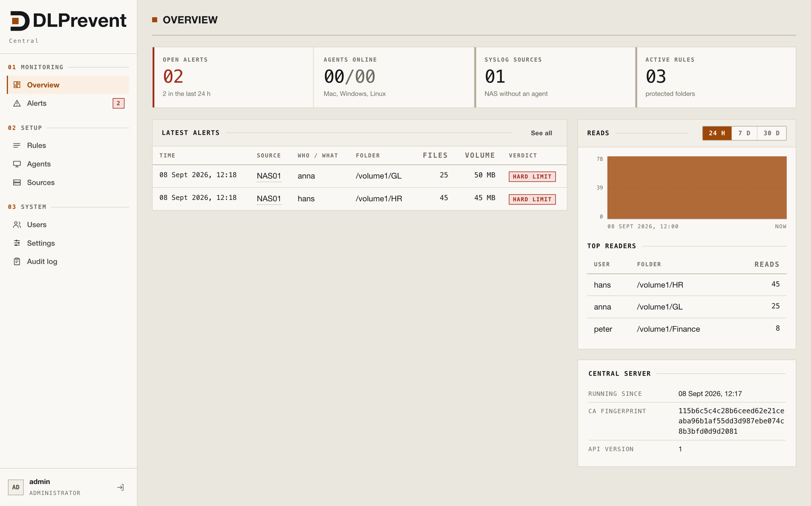

# DLPrevent

**Lean data-loss detection for macOS, Windows and Linux — with a central dashboard**

You pick the folders; the tool warns when a program reads from one of them
and then sends data outward.

---

## Why this exists

Read the breach notifications of the past few years and one sentence keeps
coming back: *an employee transferred company files to a private account.*
Not a zero-day. Not a state actor. Somebody with legitimate access, a folder
they were allowed to open, and a browser tab.

That is the moment nothing in a normal security stack is looking at. The
firewall sees an ordinary HTTPS connection. The file server sees an
authorised user opening a file — to it, indistinguishable from opening it in
Word. The antivirus is quiet, the backup runs, the logs fill up with
nothing. And when it does come out, months later, the expensive part is
rarely the data itself. It is standing in front of a regulator, a customer
or a journalist and not being able to say **what** left, **when**, and **to
where**.

DLPrevent exists to make that question answerable on the day it is asked —
and, in the places where it matters most, to make the answer *"nothing did"*.

**Three things it gives you:**

- **The moment itself, not the aftermath.** A program reads from a folder
  you named and then sends data outward — that pairing is the alert, raised
  on the device within seconds and in the dashboard with the next report.
  It names the user, the process, the files and the destination. The copy
  onto a USB stick, the drag into an AI chat, the upload split into small
  pieces to stay under a threshold: all the same shape, all caught.
- **A record you can hand to a lawyer.** Every alert is kept, with its chain,
  its timestamps and its destination — for as long as you set, two years by
  default on the central server. The difference between a notification
  obligation you can fulfil and one you can only apologise for is this
  record.
- **A folder that really is closed.** Declare a folder strict and nothing may
  leave it except to destinations you listed — every other one is an alert
  from the very first byte, never learned away, never silenced. Tick
  **Enforce** as well and the agent stops acting politely: the sending
  program loses its network on all three systems, and on a Windows
  workstation the browser upload is refused before a byte moves (Firefox
  today) and a copy that made it out of the folder is deleted again.

**And a promise about what it is not.** This is a detection tool with a
narrow enforcement edge, not a guarantee. Nobody can stop a photograph of a
screen, and anyone who sells you otherwise is selling you something else.
Exactly where the edge runs — what is blocked, what is only reported, and
what is not seen at all — is written down in plain words under
[Scope, limits and your obligations](#scope-limits-and-your-obligations),
before you install anything. Treat that section as part of the product.

## Overview

Two parts, usable separately:
- **Standalone.** The **DLPrevent** menu-bar app plus a background service on
  the Mac. Runs on its own, with no outbound network access.
- **Central server.** A dashboard with login that agents report to, syslog
  intake for NAS boxes without an agent (Synology, QNAP, TrueNAS/Samba), and
  rules for business-critical folders with an emergency brake and a learned
  baseline per user.

**Language:** English throughout — app, dashboard, command line, protocol,
this documentation and the comments in the source.

## Scope, limits and your obligations

Read this before the first agent goes out. None of it is a setting in the
dashboard; all of it is the operator's decision.

**It detects. It does not make data loss impossible.** DLPrevent watches the
folders you name and reports when a program reads from one of them and then
sends data outward. What it stops before the bytes move is narrow: a strict
folder deletes the copy and cages the sender, and an upload is refused in
Firefox only. Everything else is reported after the fact, or not seen at
all — a photo of the screen, a private phone, an encrypted container, a
channel nobody monitors. Treat it as one control among several, never as the
one that makes the others unnecessary.

**It is not an antivirus and replaces no part of your security stack.** No
malware detection, no EDR, no backup, no patch management, no access
control, no firewall. A folder the wrong people can read is a permissions
problem, and DLPrevent will do no more than tell you it is being read.

**The network is yours to segment.** The agent port (8444) belongs in the
agent networks, the dashboard (8443) in the administration networks, and
syslog (5514, mapped from 514 in Docker) must never leave the internal
network — it is unauthenticated and the sender address can be forged. The
central server holds `ca.key`;
whoever takes that can enrol as any agent. Put the server on a segment that
matches what it is worth, keep its backups off the shared drive, and verify
the firewall rules rather than assuming them. The documentation names the
ports. Deciding where they may be reached from is your job, not the tool's.

**Inform and train the people you are watching.** The tool records who read
which file and where it went. In most jurisdictions that is personal data
and monitoring at the workplace, and it is regulated — in Switzerland the
DSG, Art. 26 ArGV 3 and Art. 328b OR, in the EU the GDPR and usually an
agreement with the works council. Inform your staff before the rollout,
obtain whatever approval applies to you, and train the people who read the
alerts: an alert nobody understands is an accusation waiting to be made
against the wrong person. Set `alert_retain_days` to a period you can
justify — the default of two years is a default, not a recommendation. This
paragraph is not legal advice; ask your own counsel.

**No warranty.** The [licence](LICENSE) provides the software as is and
disclaims all warranties, and that is meant literally. False positives,
missed events and a sensor that the next Windows or macOS release changes
underneath you are all possible; the checks built into the agent (`trace`,
`check`, `probe`) exist because of it. Run them, and re-run them after every
operating-system upgrade. Whether the tool is configured, segmented and
staffed well enough for what it is guarding is something only the operator
can judge, and it stays the operator's responsibility.

## Documentation

| Topic | Where |
|---|---|
| Install, update, uninstall, mass rollout, moving the server | [docs/INSTALL.md](docs/INSTALL.md) |
| Central server: dashboard, roles, rules, agents, NAS, API | [docs/SERVER.md](docs/SERVER.md) |
| Something does not work | [docs/TROUBLESHOOTING.md](docs/TROUBLESHOOTING.md) |
| Building, layout, tests | [docs/DEVELOPMENT.md](docs/DEVELOPMENT.md) |
| Design and decisions | [docs/DESIGN.md](docs/DESIGN.md) |

## What it detects

- **Read, then send.** A program reads from a protected folder and then
  sends more than 4 KB outward. Volume is counted per program and
  destination, so slow trickling is caught too. A long upload is one
  warning whose volume grows, not one warning per measurement.
- **Process chains** such as `cat secret.pdf | curl -d @- …`: one program
  reads, another sends. The warning names both. Apps with helper processes
  (Safari reads in one process and sends in another) are merged.
- **Copies and renames.** A copy counts as the original for 24 hours.
  Copying out of the folder is itself a warning, including from Finder or a
  Nextcloud folder; a later upload of the copy is reported as well, naming
  the source.
- **Arrivals in the folder.** A file that lands *in* a protected folder is
  reported too, as a notice ("Arrived") rather than an alarm: who put it
  there, in which folder, and how many. It is the only direction the rest of
  this list does not cover — everything else follows the data outward. On
  the Mac the copy, move or hardlink names source and target, so the
  comparison alone decides. On Windows there is no copy event: the agents
  see the write and ask the file itself whether it has just come into being,
  so that saving a document that was already there stays quiet. A *move*
  inside the same drive keeps its creation time and is therefore not
  reported on Windows; over SMB — a file put into the share from a
  workstation — a new file comes into being on the server and is caught.
  Nothing is deleted or blocked for an arrival, and the learning phase never
  silences one. A process that puts files there constantly can be silenced on
  the allow list.
- **USB sticks and network drives.** A program that read from the folder
  writes or copies to an external or mounted volume. One warning per program
  and volume, with the file count.
- **Strict folders ("block all").** A folder distributed by the central
  server can be declared off-limits: nothing may leave it except to
  explicitly allowed destinations (IP or network, optional port). Browser
  upload, AI service, PowerShell — only the destination counts. Such
  warnings appear from the first byte and are never learned. Optionally the
  service does not just report them but blocks: the browser upload before
  the first byte, the network of the sending program, the copy that left the
  folder.
- **Copying out of a strict folder is forbidden as well** — to local disk,
  a USB stick or a network drive. On a Windows workstation the agent removes
  the copy again when "Enforce" is set; the Mac only reports it.
- **AirDrop and LAN neighbours** are labelled as such.
- **Detours to the same data:** Time Machine snapshots, system firmlinks and
  hard links count as the original.
- **Reputation check (optional).** The central server checks the destination
  IP of every alert against AbuseIPDB and shows how badly the address is
  known — one API key and one cache for the whole fleet, configured under
  Settings → Reputation. Only the IP address leaves the network, never a
  user, process, folder or file name. The Mac app shows the host name of the
  destination; only the DNS query leaves the machine.

System services that read every file and have network access (Spotlight,
Time Machine, iCloud, XProtect, Bitdefender) are on an exception list.
Unsigned programs are always reported.

## In the app

- Warnings arrive as notifications; a click opens the window. The icon turns
  red on a new warning and orange when a protected folder lives inside a
  sync folder (iCloud Drive, Nextcloud, Dropbox, OneDrive, Google Drive,
  Proton Drive), because the sync client stays on the exception list.
- "How" in a warning shows the route the data took to the sender.
- Filter field over the warning table: every word must occur, `-word`
  excludes. Export as CSV or JSON.
- "Ignore this process" for a service that reports constantly.
- Changes to the protection and exception lists need the admin password, so
  no program running as the user can quietly switch protection off.
- Warnings are kept for a year by default and survive restarts; every change
  to the lists is logged.

## Learning phase

For the first 7 days the service quietly collects which programs send to
which destination networks. Warnings appear in the table with the verdict
"learning" and no notification. After that the app shows "Review": go
through the list, strike out what you do not recognise, confirm. From then
on only what is new gets reported, what you marked "Always report", or what
deviates: much more volume than ever seen, or a time of day never seen
before. "Remember" in a warning makes a pair known. Unsigned programs are
never learned and always reported.

## Central server (dashboard for several devices)

For environments with file servers, NAS boxes and several workstations. One
installation per customer, deliberately without tenants. Docker or
Ubuntu/Debian package.

- **Dashboard with login:** open alerts, verdicts, reads per folder, top
  readers, working through warnings. Narrow the list by time, source,
  verdict, kind and destination reputation, and close what you have dealt
  with — one entry, a selection, or everything the filter matches.
- **Two-factor authentication:** TOTP or a passkey (WebAuthn), and you can
  require a second factor per role.
- **Audit log:** who changed a rule, revoked an agent, closed an alert.
- **Agents enrol with one command.** An administrator uploads the installer
  once, or lets the server fetch a signed release by itself; the command
  shown in the dashboard downloads it onto the device,
  checks its checksum and enrols in one go. The agent generates its own key,
  the dashboard's fingerprint pins the server, and a token is good for
  one device or, for a mass rollout, for any number until you revoke it, for
  hours, days or weeks. Enrolled agents report every 30 seconds and pick up
  protected folders from the server.
- **Four roles from four artefacts:** Windows workstation and Windows file
  server share the same EXE, the role is chosen at enrolment; macOS gets the
  app bundle; Linux gets the program for its architecture (amd64, arm64).
- **Agents update themselves from the dashboard.** The program is staged on
  the server, its signature checked against the release key; an agent fetches
  it on its next report, verifies the checksum and restarts into it. One
  device first, or the whole fleet. Certificates renew without a new token.
- **Several agents at once.** Select what the filter shows and finish the
  learning phase, order an update, revoke or delete for all of them — a
  thousand devices are not managed one row at a time.
- **NAS over syslog:** Synology, QNAP, TrueNAS/Samba send their file access
  log to the server; sources appear with the first packet.
- **Rules for critical folders:** strict folder with allow list, emergency
  brake on mass access, learned baseline per user.
- **Email notifications:** SMTP to any server, with a switch each for
  alerts, an agent that stops reporting, and a destination with a bad
  reputation. One digest per window, not one mail per event.
- **AI assistance (optional).** An **Explain** button in an alert: the server
  gathers what an administrator would otherwise look up by hand — the rule
  that matched, the destination's reputation, the same user's week, the same
  process across the fleet, the agent's log around that minute — and has a
  language model summarise it in three paragraphs. It decides nothing and
  runs only on a click. Any OpenAI-compatible endpoint: Ollama in your own
  network, where nothing leaves the house, or a hosted one such as Infomaniak.
  Off by default; what went out is stored word for word next to the answer.
- **API keys** for a SIEM or a script.

## Blocking on Windows: what is caught and what is not

Detection at the file level is **after the fact**. A copy exists for a second
or two before the agent removes it, and a rename or repackaging escapes the
user-mode agent entirely. Closing that would take a kernel driver; one was
built and measured, and removed again on 2026-09-09 because it never loaded
outside a lab with Secure Boot off. Until a signed one ships, those ways out
of a strict folder stay open.

What does stop an upload works before the first byte and needs no driver: the
browser connector refuses and knows the target URL, and the network cage takes
the network from a program that has read from a strict folder.

## Status

Milestone 1 (macOS, warn), the learning phase (M2) and the Linux agent (M3)
are in, and the central server is at stage Z2: both Windows roles observe and
report. The first intervention is the strict folder — on the Mac, on the
**Windows workstation**, whose sensors have run on real hardware (Windows 11
Enterprise, 2026-09-07), and on **Linux**. That also catches what a file
server fundamentally cannot see: dragging a file from the share into a
browser or an AI service.
Stopping such an upload before it moves needs the browser to ask. The
connector speaks Google's Content Analysis protocol, which **Firefox** (137
and newer) and Chrome both speak — but only Firefox's policy is written for
you at installation, so anything else is reported after the fact, see
[SERVER.md](docs/SERVER.md).

The **Windows file server agent** (Z2) reads the security log (4663/5145) and
the share table, and was validated against the lab domain controller on
2026-09-06. The **Linux agent** (M3) reports as of 2026-09-12: fanotify for
file access, `ss` for the bytes sent, same binary and same dashboard as the
Mac, as a `.deb` for Debian and Ubuntu — and the network cage runs there too,
through nftables and a cgroup per process.

Still open is **Z3**: locking down at the file server — lockdown by
permission, blocking on mass access, emergency stop. The rule fields are in
the dashboard; no agent acts on them yet. Blocking at the endpoint on macOS
needs a Developer ID build, because the network filter is a system extension;
on Windows the file-level layer reports and deletes the copy, while the
upload itself is stopped by the browser connector and the network cage.

## Roadmap

- **Windows kernel driver for customers.** A minifilter is the only way to
  refuse a copy *before* it happens. The lab version is removed; a shippable
  one needs an EV certificate and Microsoft attestation signing.
- **Linux, the rest of it.** Read-then-send detection and the network cage
  of strict folders are in. Still missing: uploads over QUIC — the kernel
  keeps no byte counter for UDP — and external volumes.
- **Cloud hosting on request.** A hosted central server per customer,
  operated by us. Ask via info@dlprevent.ch.
- **Finer-grained access control.** Today an account is either administrator
  or read only, for the whole server ([SERVER.md](docs/SERVER.md#roles)).
  Planned: an operator role between the two, and a scope per agent or agent
  group instead of all-or-nothing.
- **Enterprise single sign-on (SSO).** SAML 2.0 and LDAP, so an account comes
  from your own identity provider (Microsoft Entra ID, Okta, on-premises
  Active Directory) instead of being created in the dashboard.

## License

DLPrevent is open source under the [Apache License 2.0](LICENSE): use it,
change it and pass it on, commercially too, as long as the copyright and
license notices go with it ([NOTICE](NOTICE)).

The [enterprise edition](#enterprise-edition) is licensed separately under
commercial terms and is not part of this repository. Everything in this
repository stays free under Apache 2.0.
